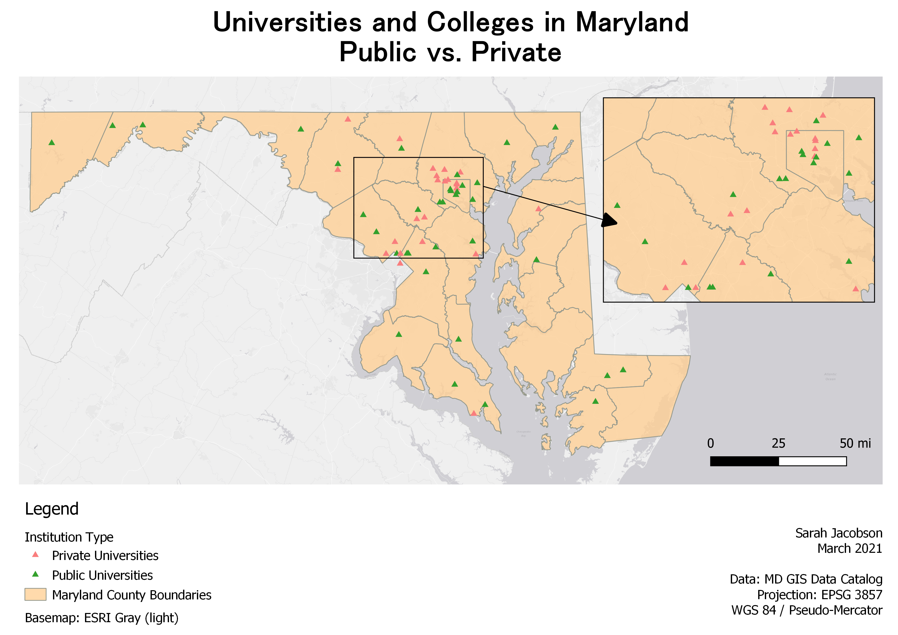
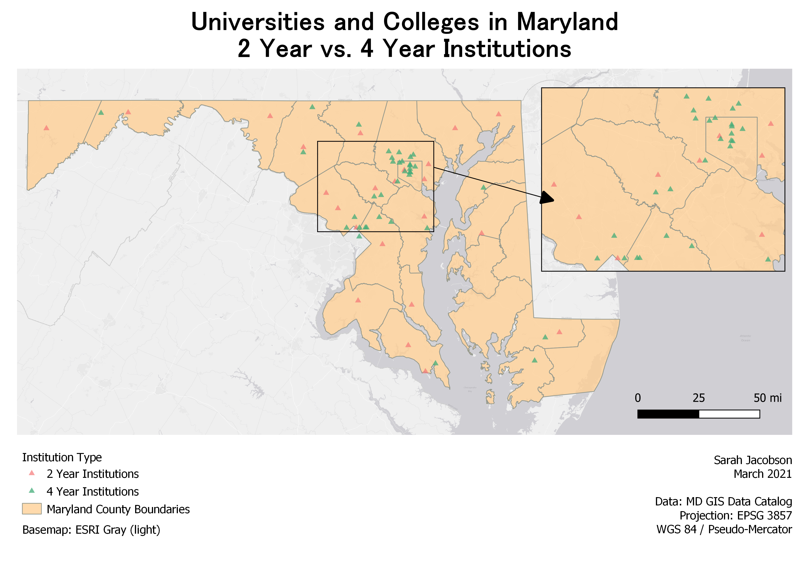
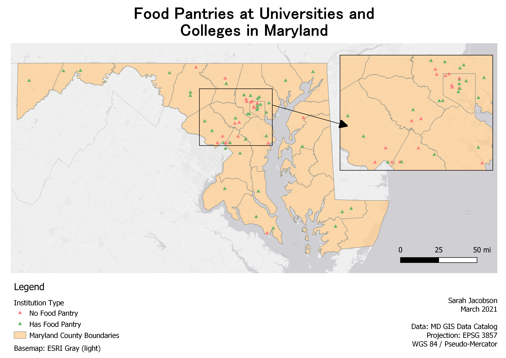
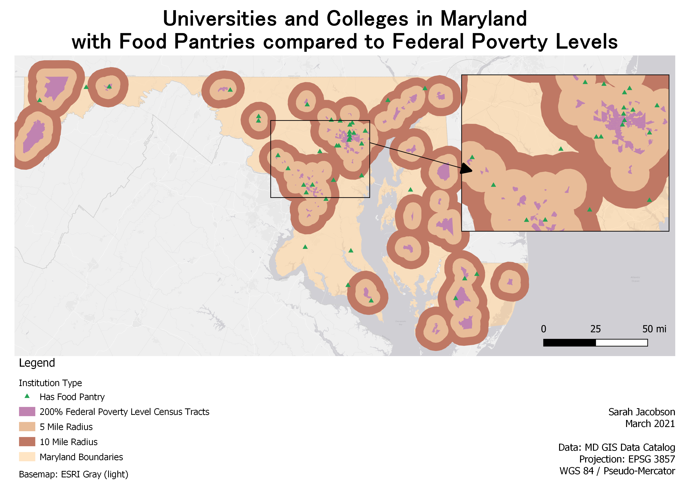

#### Food Insecurity among College Students in Maryland

### **Introduction** 
 
  In collaboration with the UMBC food pantry, Retriever Essentials, I am conducting geospatial analyses and generating an online webmap that assesses the pervasive issue of food insecurity among Maryland college students to recommend how institutional food pantries can implement operational best practices to effectively meet student need during the COVID-19 pandemic. Current research states that approximately one-third of all students at two- and four- year institutions face food and housing insecurity while earning a degree. Through geospatial analysis on food and poverty rates in Maryland, my research illustrates the connection between federally recognized poverty areas and food insecurity rates to which institutions, based on their location and institution type, are most likely to provide food resources to their students. We identified campus pantry points-of-contact, and conducted a semi-structured survey to understand campus pantry operations and services in more detail, along with assessing how analyses on how COVID-19 has impacted a pantry’s ability to provide the resources needed by their students. Retriever Essentials and I plan to utilize the data as part of a comprehensive effort to assess the availability of food and basic needs resources on Maryland college campuses, and what campuses can do to better connect students with these resources.

### Data 

  The data below are series of shapefiles containing Maryland's higher education institutions. This will provide the preliminary base for research on which institutions provided a food pantry or food resources to their students, and then conducting further analysis on the operations of individual food pantries among Maryland colleges and universities. Through an impact survey, I was able to gain data representative of approximately 30% of all Maryland institutions with a food pantry. Data includes the best operational practices for each site, how many clients they serve, how they quantify food and time donated, and how COVID-19 impacted their ability to operate as normal, and continue servicing their communities. The continuation of my data and map analyses will include comparisons of varying economic factors within the state, and how as a result, each region has to service and operate in different ways to meet the needs of their clients.

[ArcGIS Online, MD iMAP: Maryland Education Facilities - Higher Education (Public Two Year) 2019](https://opendata.maryland.gov/Education/MD-iMAP-Maryland-Education-Facilities-Higher-Educa/bwdz-rgcj)

[ArcGIS Online, MD iMAP: Maryland Education Facilities - Higher Education (Private Four Year), 2019](https://opendata.maryland.gov/Education/MD-iMAP-Maryland-Education-Facilities-Higher-Educa/ejcy-gama)

[ArcGIS Online, MD iMAP: Maryland Education Facilities - Higher Education (Private Two Year), 2019](https://opendata.maryland.gov/Education/MD-iMAP-Maryland-Education-Facilities-Higher-Educa/hhju-9ctd)

[ArcGIS Online, MD iMAP: Maryland Education Facilities - Higher Education (Public Four Year), 2019](https://opendata.maryland.gov/Education/MD-iMAP-Maryland-Education-Facilities-Higher-Educa/p733-7wzs)

[Johns Hopkins University; Center for a Livable Future, % Food Insecure 2017](https://data-clf.hub.arcgis.com/datasets/1d070188731c4e1eba4eb486619edfd1_449?geometry=-80.757%2C37.310%2C-73.780%2C40.306)

[Johns Hopkins University; Center for a Livable Future, 200% Federal Poverty Level 2014-2018](https://data-clf.hub.arcgis.com/datasets/16cf6aa531bf46f79384da68b56b7175_457?geometry=-80.767%2C37.331%2C-73.791%2C40.325)

### Colleges and Institutions in Maryland: How does college intersect with food insecurity?
  When considering institution type, and how to best categorize the colleges to better understand the connections between being a student and being food insecure, we found it best to consider schools in two aspects: are they a four-year or two-year institution, and are they private or public? These categories are important to consider, as certain institutions will better service and be accessible to different types of populations. According to the [National Center for Education Statistics](https://nces.ed.gov/fastfacts/display.asp?id=76), in the United States between the 2007-08 and 2017-18 educational years, prices for undergraduate degrees at public institutions rose by 31% with an average cost of $20,000 a year, and cost of tuition rose 23% with an average cost of $40,000 a year. Another study done by [Georgetown University](https://cew.georgetown.edu/cew-reports/americas-divided-recovery/) found that roughly 65% of people in the workforce have obtained some postsecondary education, with Bachelor's degree holders earning 57% of all wages. People choose to get degrees because of better wages, benefits, and increased opportunities for employment. However, the cost is great, especially when moving beyond two-year, public universities where the average cost of tuition is approximately $5,000 a year. 
  
  The cost of tuition often dictates which type of student, depending on their wealth and resources, will be able to afford pursuing a postsecondary education. Considering how various socioeconomic factors play into the services and aid that institutions provide their students is crucial when discussing how stress from college courses and paying for tuition intersect with stressors for those experiencing poverty or food insecurity and the effects it can have on a person's physical, emotional, and mental health.   
 
 ### Map Analysis 
 There are 53 institutions and colleges represented in these maps, although several have various campuses and may be displayed in the map as well. There are 13 public, four-year universities, 23 private, four-year universities, 16 two-year public colleges, and one two-year private college.

 There are 13 public, four-year universities, 23 private, four-year universities, 16 two-year public colleges, and one two-year private college. Private universities and colleges make up 45% of all MD higher education institutions, with public schools making up the other 55%. 

  32% of institutions are two-year colleges, with four-year institutions making up the other 68%. Further analysis shows that 2% of institutions are both private, and two-year institutions, 30% are public, two-year institutions, 43% are private, four-year institutions, and 25% are public, four-year institutions. 

  The map above illustrates which campuses provide food pantries or food resources to their students and staff. 38% of all institutions 

### Colleges with Food Pantries vs. Federal Poverty Level Areas

The image displays all colleges and universities in Maryland with a food pantry available to students, alongisde a 5 and 10 mile radius of census tracts that are at 200% of the Federal Poverty Level. This means that these census tract areas have an average household income that is only 2 times above the Federal Poverty Level, and are at a high risk of experiencing poverty, food, housing, and basic needs insecurity. 

For more details see [GitHub Flavored Markdown](https://guides.github.com/features/mastering-markdown/).
