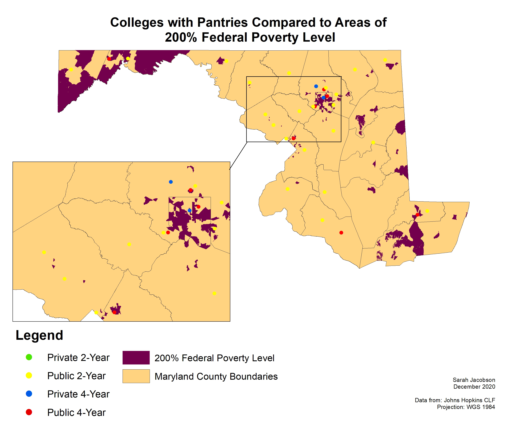

## Food Insecurity among College Students in Maryland

**Project description:** In collaboration with the UMBC food pantry, Retriever Essentials, I am conducting geospatial analyses and generating an online webmap that assesses the pervasive issue of food insecurity among Maryland college students to recommend how institutional food pantries can implement operational best practices to effectively meet student need during the COVID-19 pandemic. Current research states that approximately one-third of all students at two- and four- year institutions face food and housing insecurity while earning a degree. Through geospatial analysis on food and poverty rates in Maryland, my research illustrates the connection between federally recognized poverty areas and food insecurity rates to which institutions, based on their location and institution type, are most likely to provide food resources to their students. We identified campus pantry points-of-contact, and conducted a semi-structured survey to understand campus pantry operations and services in more detail, along with assessing how analyses on how COVID-19 has impacted a pantry’s ability to provide the resources needed by their students. Retriever Essentials and I plan to utilize the data as part of a comprehensive effort to assess the availability of food and basic needs resources on Maryland college campuses, and what campuses can do to better connect students with these resources.

**DATA**

The data below are series of shapefiles containing Maryland's higher education institutions. This will provide the preliminary base for research on which institutions provided a food pantry or food resources to their students, and then conducting futher analysis on the operations of individual food pantries among Maryland colleges and universities. Through an impact survey, I was able to gain data representative of approximately 30% of all Maryland insitutions with a food pantry. Data includes the best operational practices for each site, how many clients they serve, how they quantify food and time donated, and how COVID-19 impacted their ability to operate as normal, and continue servicing their communities. The continuation of my data and map analyses will include comparisons of varying economic factors within the state, and how as a result, each region has to service and operate in different ways to meet the needs of their clients.

ArcGIS Online, MD iMAP: Maryland Education Facilities - Higher Education (Public Two Year) 2019, https://opendata.maryland.gov/Education/MD-iMAP-Maryland-Education-Facilities-Higher-Educa/bwdz-rgcj

ArcGIS Online, MD iMAP: Maryland Education Facilities - Higher Education (Private Four Year), 2019. https://opendata.maryland.gov/Education/MD-iMAP-Maryland-Education-Facilities-Higher-Educa/ejcy-gama

ArcGIS Online, MD iMAP: Maryland Education Facilities - Higher Education (Private Two Year), 2019. https://opendata.maryland.gov/Education/MD-iMAP-Maryland-Education-Facilities-Higher-Educa/hhju-9ctd

ArcGIS Online, MD iMAP: Maryland Education Facilities - Higher Education (Public Four Year), 2019. https://opendata.maryland.gov/Education/MD-iMAP-Maryland-Education-Facilities-Higher-Educa/p733-7wzs

Johns Hopkins University; Center for a Livable Future, % Food Insecure 2017, 2017. https://data-clf.hub.arcgis.com/datasets/1d070188731c4e1eba4eb486619edfd1_449?geometry=-80.757%2C37.310%2C-73.780%2C40.306

Johns Hopkins University; Center for a Livable Future, 200% Federal Poverty Level 2014-2018, 2018. https://data-clf.hub.arcgis.com/datasets/16cf6aa531bf46f79384da68b56b7175_457?geometry=-80.767%2C37.331%2C-73.791%2C40.325
### Food Insecurity Rates in Maryland

One of many developed maps in this entire project, this map highlights the food insecurity rates, by county, in Maryland contrasted against all colleges within Maryland that provide food resources for their students and staff. In order to create this image, I had to use opensource data from the Maryland that gave me most of the data needed for the maps I have developed. To develop the maps, I used ESRI ArcMap as it allows for an easy transition to an online format for the creation of the future webmap. As the project is ongoing, the research has not been completed, but the work is going forward!

## Colleges with Food Pantries vs. Federal Poverty Level Areas
#### The image displays all colleges and universities in Maryland with a food pantry available to students, in comparison to census tracts in Maryland that are at 200% of the Federal Poverty Level. This means that these census tract areas have an average household income that is only 2X above the Federal Poverty Level, and may experience poverty, food, housing, and basic needs insecurity. 

---
## Colleges with Food Pantries within 10 Miles of Federal Poverty Level Areas
#### The image displays all colleges and universities in Maryland with a food pantry available to students that are within a 10 mile radius of areas that are at 200% of the Federal Poverty Level. A lot of campuses, specifically community colleges, have commuter students. We wanted to represent universities and colleges that reflect that, and if they are near a Federal Poverty Level, that may contribute to the need for a food pantry on campus. 

For more details see [GitHub Flavored Markdown](https://guides.github.com/features/mastering-markdown/).
