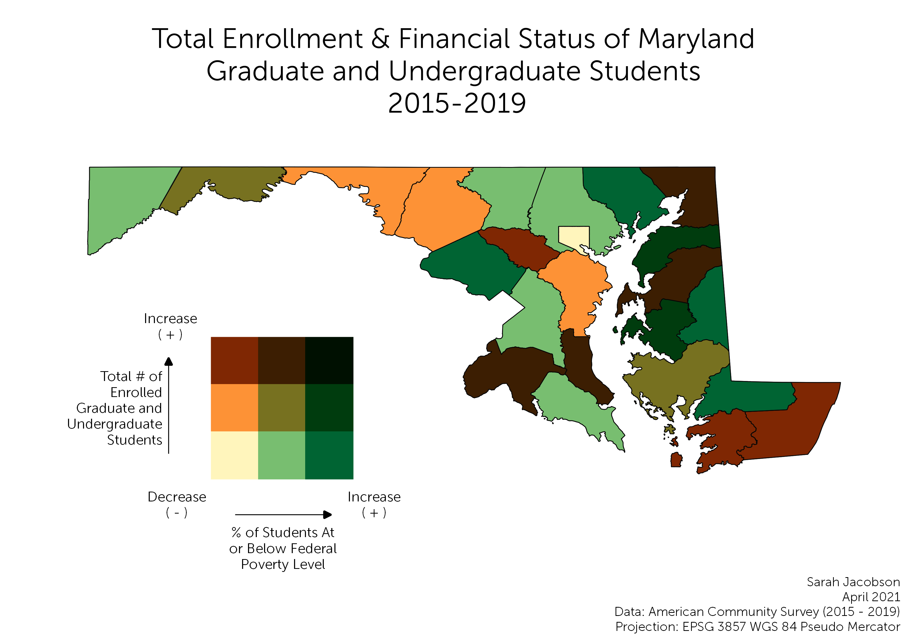

## Portfolio

---

# Projects
## [Food Insecurity Among College Students in Maryland](/food_insecurity)
#### The image displays all colleges and universities in Maryland with a food pantry available to students, in comparison to food insecurity rates by county. This allows us to draw a connection between the individual food insecurity rates of counties, and possible reasons why colleges may have chosen to provide a food pantry, as it is a need of their students and staff that must be met.  

---
## [Baltimore City Canopy Cover Change](/project2/index)
#### Below is a map displaying the city of Baltimore, MD and the changes in tree canopy cover throughout the city. There are many areas with noticeable change, either through a gain or loss of canop cover, and other large areas that have had no change. These changes, or lack thereof, are a result of redlining, with has led to systemic divisions between neighborhoods in Baltimore, and the access they have to green spaces. 

---
## [Effects of Poverty on Undergraduate and Graduate Enrollment in Maryland Over Time](/lab_6/lab_6.html)
#### Analysis on the changes between the years of 2015 and 2019 on the total number of enrolled undergraduate and graduate students in Maryland and the percentage of those students who were at or below the federal poverty level during the same period.

 

---

### Category Name 2

- [Project 1 Title](http://example.com/)
- [Project 2 Title](http://example.com/)
- [Project 3 Title](http://example.com/)
- [Project 4 Title](http://example.com/)
- [Project 5 Title](http://example.com/)

---

---

Page template forked from <a href="https://github.com/evanca/quick-portfolio">evanca</a>

<!-- Remove above link if you don't want to attibute -->
