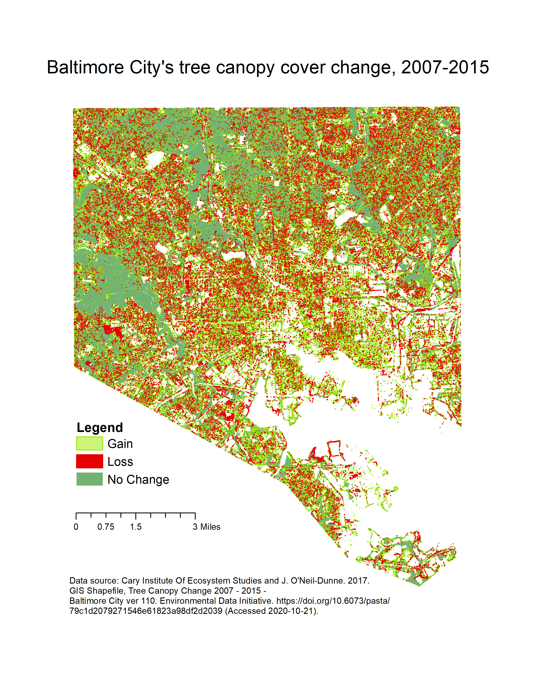

## Portfolio

---

# Projects
## College Pantries within Maryland: A Study on Food Insecurity within College Students 
#### The image displays all colleges and universities in Maryland with a food pantry available to students, in comparison to food insecurity rates by county. This allows us to draw a connection between the individual food insecurity rates of counties, and possible reasons why colleges may have chosen to provide a food pantry, as it is a need of their students and staff that must be met.  
[Colleges with Food Pantries vs. MD County Food Insecurity](/sample_page)

---
## Baltimore Canopy Cover Change: 2007 - 2015
#### Below is a map displaying the city of Baltimore, MD and the changes in tree canopy cover throughout the city. There are many areas with noticeable change, either through a gain or loss of canop cover, and other large areas that have had no change. These changes, or lack thereof, are a result of redlining, with has led to systemic divisions between neighborhoods in Baltimore, and the access they have to green spaces. 
[Baltimore City Canopy Cover Change](/project2_page)

---
## 
#### 

---

### Category Name 2

- [Project 1 Title](http://example.com/)
- [Project 2 Title](http://example.com/)
- [Project 3 Title](http://example.com/)
- [Project 4 Title](http://example.com/)
- [Project 5 Title](http://example.com/)

---

---

Page template forked from <a href="https://github.com/evanca/quick-portfolio">evanca</a>

<!-- Remove above link if you don't want to attibute -->
