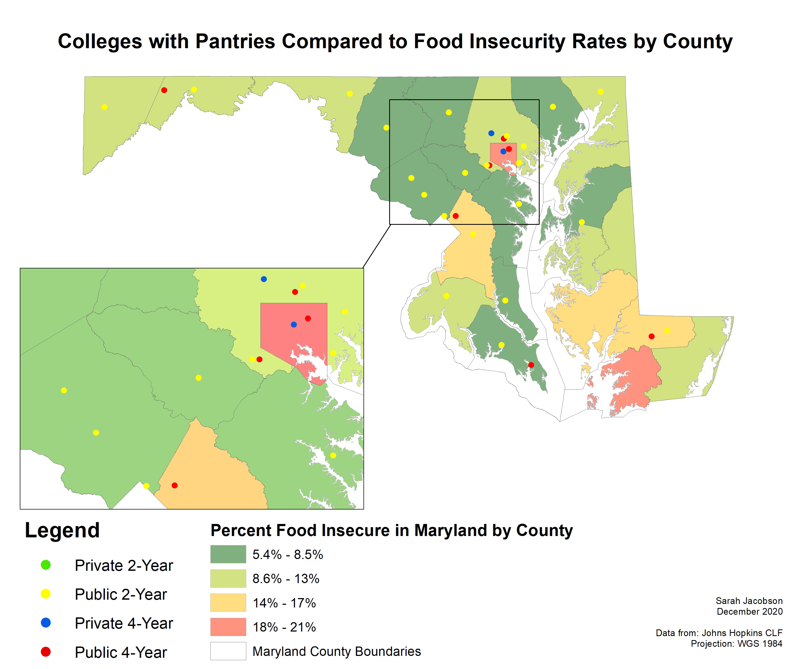
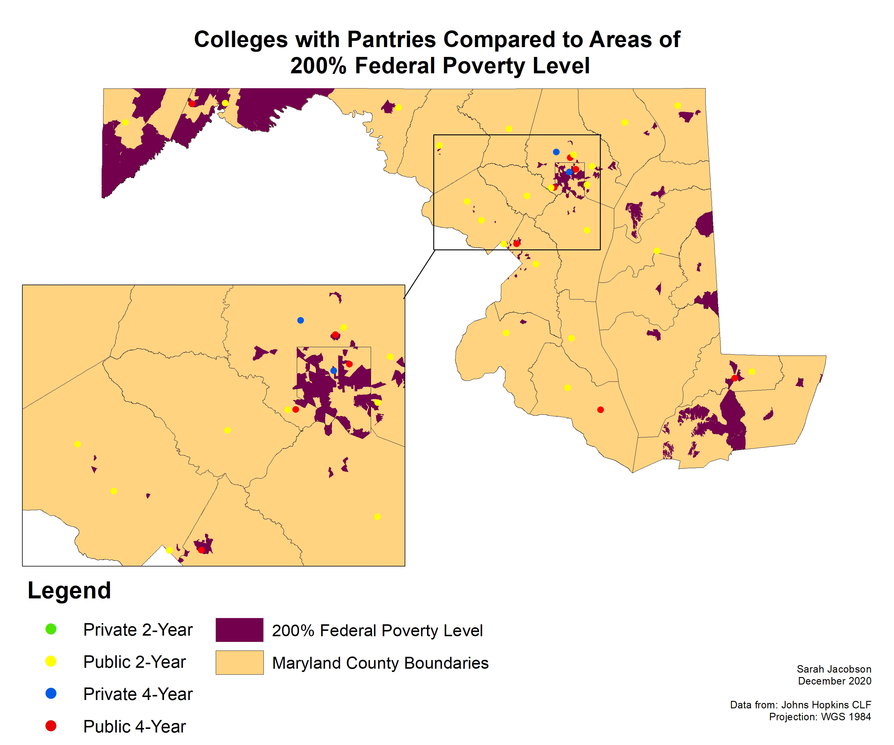
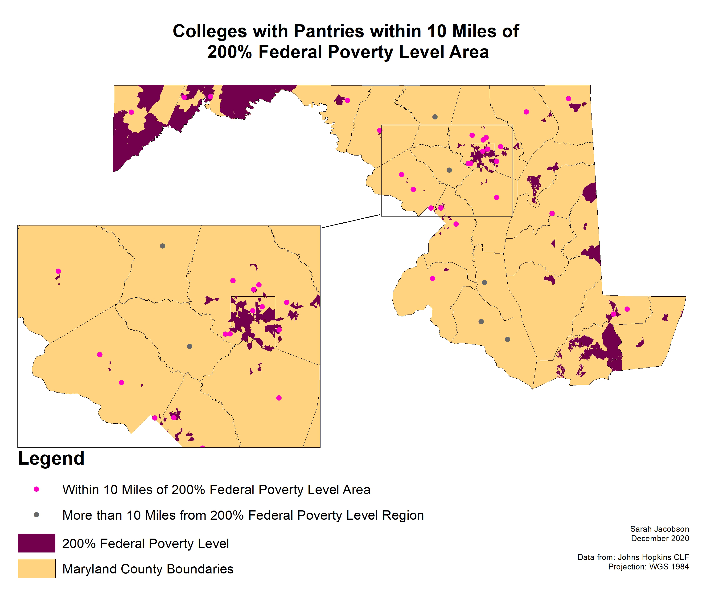

## Portfolio

---

# College Pantries within Maryland: A Study on Food Insecurity within College Students 
## Colleges with Food Pantries vs. MD County Food Insecurity Rates
#### The image displays all colleges and universities in Maryland with a food pantry available to students, in comparison to food insecurity rates by county. This allows us to draw a connection between the individual food insecurity rates of counties, and possible reasons why colleges may have chosen to provide a food pantry, as it is a need of their students and staff that must be met.  
[Colleges with Food Pantries vs. MD County Food Insecurity](/sample_page)

[]

https://raw.githubusercontent.com/sarahqj9/sarahqj9.github.io/master/images/pantriesfoodinsecurity.png

---
## Colleges with Food Pantries vs. Federal Poverty Level Areas
#### The image displays all colleges and universities in Maryland with a food pantry available to students, in comparison to census tracts in Maryland that are at 200% of the Federal Poverty Level. This means that these census tract areas have an average household income that is only 2X above the Federal Poverty Level, and may experience poverty, food, housing, and basic needs insecurity. 
[Colleges with Food Pantries vs. Federal Poverty Level](/federal_page)

[]

https://raw.githubusercontent.com/sarahqj9/sarahqj9.github.io/master/images/povertylevel.png

---
## Colleges with Food Pantries within 10 Miles of Federal Poverty Level Areas
#### The image displays all colleges and universities in Maryland with a food pantry available to students that are within a 10 mile radius of areas that are at 200% of the Federal Poverty Level. A lot of campuses, specifically community colleges, have commuter students. We wanted to represent universities and colleges that reflect that, and if they are near a Federal Poverty Level, that may contribute to the need for a food pantry on campus. 
[Colleges with Food Pantries within 10 Miles of Federal Poverty Level](http://example.com/)

---

### Category Name 2

- [Project 1 Title](http://example.com/)
- [Project 2 Title](http://example.com/)
- [Project 3 Title](http://example.com/)
- [Project 4 Title](http://example.com/)
- [Project 5 Title](http://example.com/)

---

---

Page template forked from <a href="https://github.com/evanca/quick-portfolio">evanca</a>

<!-- Remove above link if you don't want to attibute -->
