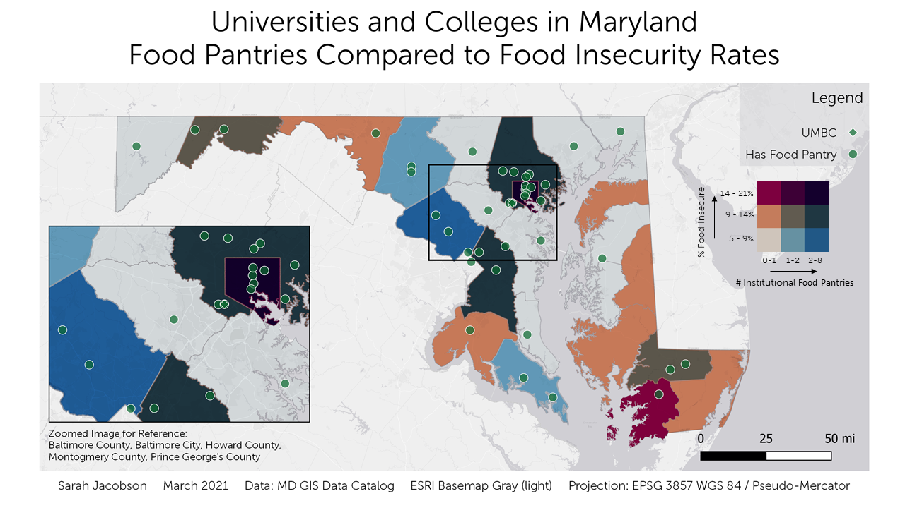
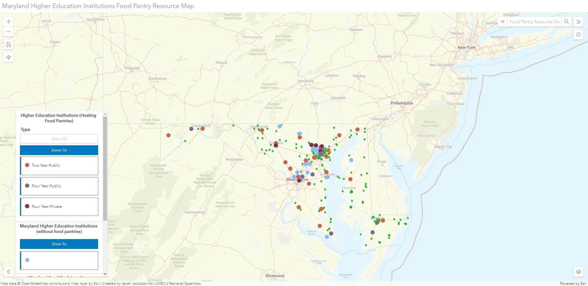

## Portfolio

---

# Projects
## [Food Insecurity on Maryland College Campuses](/food_insecurity)

Current research states that approximately one-third of all students at two- and four- year institutions face food and housing insecurity while earning a degree. Through geospatial analysis on food and poverty rates in Maryland, my research illustrates the connection between MD food insecurity rates to which institutions, based on their location and institution type, are most likely to provide food resources to their students. 

The maps on this site are just one part of a larger research project where I take a look at disparities between resources on different types of institutions, along with surveying campus food pantry directors on how their pantries run along with how the onset of the COVID-19 pandemic affected their ability to provide resources, how they had to adapt, and what their pantries look like now to continue to serve the needs of their community.  

If you would like to learn more about this research, check out my [full presentation here!](https://voicethread.com/share/17404326/)

---
## [Food Insecurity Map Breakdown](/project2/index)
#### This page walkthroughs the steps and processes required to complete the map products utilized in my [Food Insecurity On Maryland College Campuses](/food_insecurity) project that focuses on addressing the issue of increasing rates of food insecurity among college students.

---
## [Effects of Poverty on Undergraduate and Graduate Enrollment in Maryland Over Time](/Lab6_Jacobson/index.md)
#### Analysis on the changes between the years of 2015 and 2019 on the total number of enrolled undergraduate and graduate students in Maryland and the percentage of those students who were at or below the federal poverty level during the same period.

 

---

### Category Name 2

- [Project 1 Title](http://example.com/)
- [Project 2 Title](http://example.com/)
- [Project 3 Title](http://example.com/)
- [Project 4 Title](http://example.com/)
- [Project 5 Title](http://example.com/)

---

---

Page template forked from <a href="https://github.com/evanca/quick-portfolio">evanca</a>

<!-- Remove above link if you don't want to attibute -->
